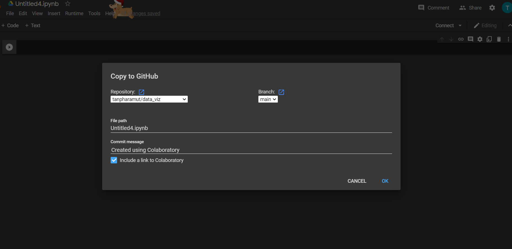

# data_viz
ปรมัตถ์ มากเจริญ 613021016-5
ตัวอย่างการแทรกรูป.

วิธีการ save in github

1.ให้คลิ๊กที่ file เเล้วเลือก save in github

2.ให้ตั้งชื่อไฟล์ที่จะ save เเละเขียน comment
3.กด OK เป็นอันเสร็จสิ้น
